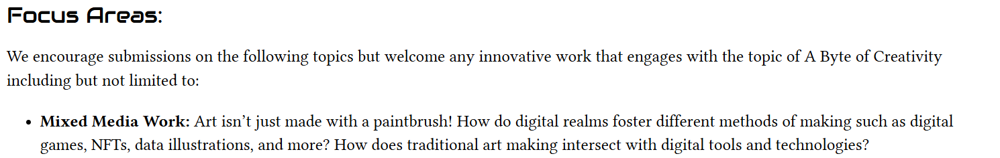
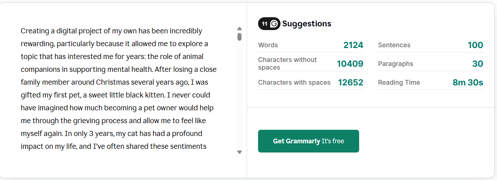

Gabby's Review: 

---

**Title:** Paws and Hearts: A Static Website Showcasing the Mental Health and Wellness Benefits of Pet Ownership  
**Author:** Melissa Tuniewicz  
**Issue #:** 3  
**Date:** July 30th, 2025  
**Created for:** CTS3030 - Summer Research Project
**Tags:** Pets, Wellness, Digital Art, Web Design  

- *clear and consice metadata*
- *i think the date needs to be in "year-month-day"  time format*
- *"issue" 3*
- *tags are well done*
- *if you wanted you could include the bio from your website into the metadata*
---

### Abstract
Paws and Hearts is a community-driven minimal computing project that presents a collection of stories and photographs highlighting the mental health and wellness benefits of pet ownership. With stories sent in by real individuals, each contribution is raw and authentic, helping to create a wholesome online space where vulnerability is encouraged. Enhanced by original illustrations and guided by web design and user experience principles, it stands as an online space that seamlessly blends scholarly research and creativity, presenting a potentially sensitive subject matter into a visually immersive digital format.    

 - *very compelling, and atratcs the reader to want to continue*

---

**Link:** [Paws and Hearts Website](https://paws-and-hearts.neocities.org/_site/)  
**Blog Post:** [Paws and Hearts: From Theory to Practice](https://melissatuniewicz2.wixsite.com/melissa-tuniewicz1/post/paws-and-hearts-from-theory-to-practice)

---
- *i think you were supposed to take a section from your webite and try to encode in in markdown with photos and links embeded, not just a link*
-  *the webiste and blogs themselves are well done and have an an appealing layout*
-  *I'm a fan of the original art work you made for the project*
-  *The links work fine but the work itself isn't in markdown*
-  *headers are a good size to break up work*
-  *I like the inclusion of the section breaks, makes differnt segments clear*
---

### **Works Cited**

Clement, Tanya E. “Where Is Methodology in Digital Humanities?” In *Debates in the Digital Humanities 2016*, edited by Matthew K. Gold and Lauren F. Klein. Minneapolis: University of Minnesota Press, 2016. [https://doi.org/10.5749/9781452963761](https://doi.org/10.5749/9781452963761).

Grant, Will. *101 UX Principles: A Definitive Design Guide.* 1st ed. Birmingham: Packt Publishing, 2018.

Hawkins, Robert D., Emily L. Hawkins, and Laura Tip. “‘I Can’t Give Up When I Have Them to Care For’: People’s Experiences of Pets and Their Mental Health.” *Anthrozoös* 34, no. 4 (2021): 543–562. [https://doi.org/10.1080/08927936.2021.1914434](https://doi.org/10.1080/08927936.2021.1914434).

Karmokar, Sashi, Harjit Singh, and Felix B. Tan. “Using Multidisciplinary Design Principles to Improve the Website Design Process.” *Pacific Asia Journal of the Association for Information Systems* 8, no. 3 (2016): 17–44. [https://doi.org/10.17705/1pais.08302](https://doi.org/10.17705/1pais.08302).

Keating, Michelle, Nic Rubenis, Sarah Carson, and Anne Terhell. *The Pet Project: People, Pets & Art.* Hobart: University of Tasmania, 2024. [https://www.the-petproject.com/about-1](https://www.the-petproject.com/about-1).

Pandey, Meghna. “The Power of Pastel Colors in Designing.” *Artwork Flow,* 2023. [https://www.artworkflowhq.com/resources/the-power-of-pastel-colors-in-designing](https://www.artworkflowhq.com/resources/the-power-of-pastel-colors-in-designing).

Pilsch, Andrew. “Locating the Minimal in Minimal Computing Pedagogy: Minimal Computing Tools and the Classroom Management of Student Composing Workflows.” *Journal of Educational Media* 49, no. 5 (2024): 769–779. [https://doi.org/10.1080/17439884.2024.240182](https://doi.org/10.1080/17439884.2024.240182).

- *links work fine*
- *i think you were supposed to use footnotes like [^1] to link your work and citations together. but because you're missing the work and just have a link there is a disconnect*

Communication, style, and polish (5/5)
- *very well written, i like your communication style and persuasiveness in your writing*

Relevance to special issue theme (3/5)
- *i feel like the art itself can fit with the theme but the pets themselves are lost on me and i dont see the connection*

Overall originality, creativity, and strength of ideas (4/5)
- *very good idea, and great way to show it, felt like scrolling down a twitter feed made especially for animals. I've just come across this idea before is all*

Accuracy and completion of Markdown code (2/5)
- *missing footnotes and the work itself being encoded in markdown, top banner not working because not a file on my computer. metadata done well*

overall: 15/20 - 75%

---

My Reflection:

When creating Paws and Hearts this summer in CTS3030, I wanted to ensure that all corresponding written pieces were extremely high quality and competent gramatically. Given Gabby's score of 5/5 in the communication section, I am pleased that my efforts were acknowledged. Aditionally, she found my abstract to be engaging, prompting further curiosity in readers, so I feel as if no modifications are needed here. 

I feel as if the relevance to issue theme is somewhat subjective. While Gabby did not feel as if my project was a good fit for the journal, I received positive feedback from the editorial teamm. Despite my submission being accepted, these contrasting perspectives have left me somewhat unsure about how to edit this submission and draw readers attention to more profound connections to our theme. After reviewing the CFP once more, I think Paws and Hearts works well in the area of mixed media work (see below) so I feel comfortable in my decision to submit to the journal.

Of course, I am always receptive to constructive feedback, so If I am ever in a postion to submit academic work for a different journal during my undergraduate journey, I will make sure to submit something that aligns more closely with the themes vision!

My lowest score lies in the "accuracy and completion of markdown code section." The main piece of feedback here was in regards to my project not being properly encoded in markdown. Unfortunately, you cannot use embeds in GitHub markdown, so providing the Neocities link where my project is hosted was the only realistic way my project could be viewed. That being said, I most definitely could have encoded my reflection blog post in markdown. I had thought about doing so initially, 

